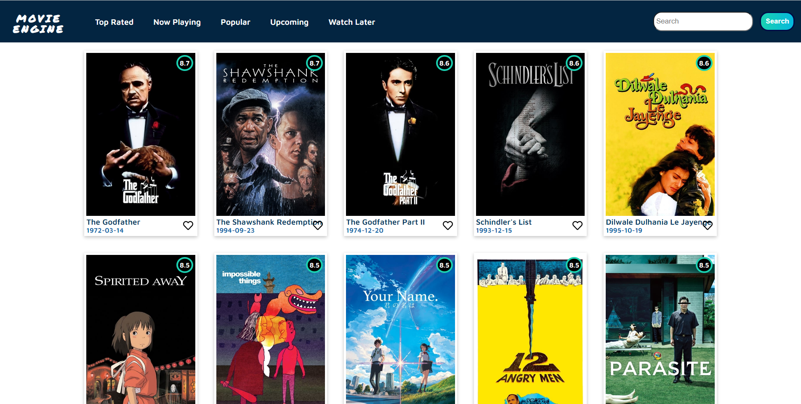
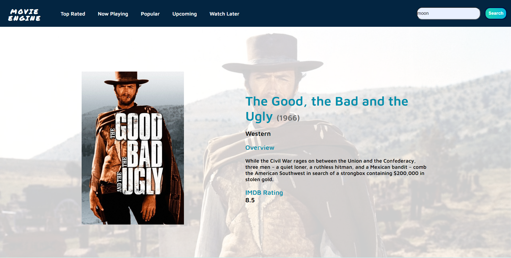
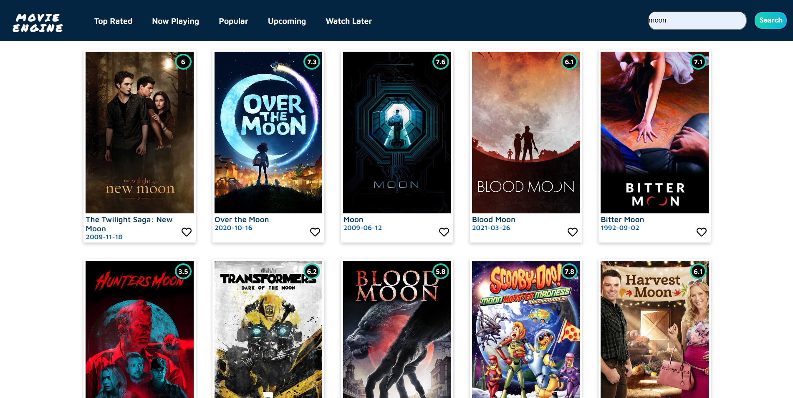

# Project Title : Movie Engine

This project was created  [Create React App](https://github.com/facebook/create-react-app) with CSS styled.

## Project Spesifications

In the project directory, you can run:

## Used API
In this project [TMDB API](https://developers.themoviedb.org/3/getting-started/introduction) is used.

To get Movie list , this link [https://api.themoviedb.org/3/movie/'now_playing'?api_key=<<api_key>>&language=en-US&page=1](https://api.themoviedb.org/3/movie/now_playing?api_key=<<api_key>>&language=en-US&page=1) is used.

To get Movie details, this link [https://api.themoviedb.org/3/movie/{movie_id}?api_key=<<api_key>>&language=en-US](https://api.themoviedb.org/3/movie/{movie_id}?api_key=<<api_key>>&language=en-US)

To search movies by text , this link [https://api.themoviedb.org/3/movie/{category}?{API_key}&language=en-US&page=page_number](https://api.themoviedb.org/3/movie/${category}?${API_key}&language=en-US&page=${page}) is used.

## Live Link
You can reach the live project here [Movie Engine](https://movieengineapp.netlify.app/)

## Project GitHub Link
You can reach the live project here [Project GitHub Link](https://github.com/SezginYurdakul/movie_engine)

## Project Live Screen Capture
Movie List Page

Movie Detail Page

Movie Search Result Page

